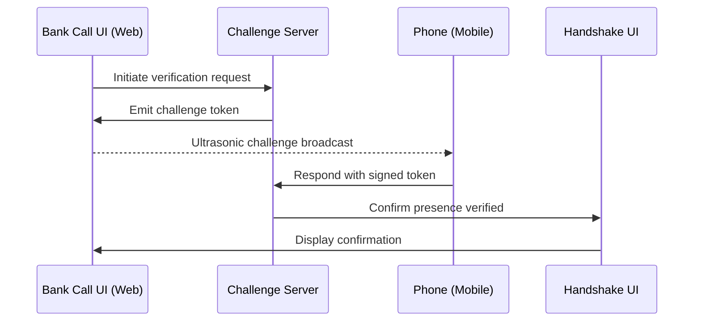

# 🛡️ PRESENCE Protocol

**Anti-Deepfake Physical Presence Verification System**

PRESENCE is a proof-of-concept system that verifies a person's physical presence during sensitive transactions (e.g., bank calls) using simulated ultrasonic challenge-response tokens and a visual handshake confirmation flow.

---

## Architecture



## Project Structure

```
presence.protocol/
├── web/                  # Next.js 14 (App Router + Tailwind CSS)
│   ├── src/app/call/     # Bank transaction call simulator
│   ├── src/app/phone/    # Mobile ultrasonic challenge emitter
│   └── src/app/handshake/# Visual handshake confirmation UI
├── server/               # Node.js + Express backend
│   ├── src/routes/       # API route handlers
│   └── src/services/     # Challenge-response engine
├── shared/               # Shared TypeScript types & contracts
│   └── src/types.ts      # Challenge/response type definitions
├── package.json          # Monorepo workspace root
└── README.md             # You are here
```

## Getting Started

### Prerequisites

- **Node.js** ≥ 18
- **npm** ≥ 9

### Installation

```bash
# Clone the repository
git clone <repo-url> presence.protocol
cd presence.protocol

# Install all workspace dependencies
npm install
```

### Environment Setup

```bash
# Copy example env files
cp web/.env.example web/.env.local
cp server/.env.example server/.env
```

### Development

```bash
# Run both web and server in development mode
npm run dev

# Or run individually
npm run dev:web      # Next.js on http://localhost:3000
npm run dev:server   # Express on http://localhost:4000
```

## Workspaces

| Workspace | Description | Port |
|-----------|-------------|------|
| `web` | Next.js frontend — call UI, phone page, handshake | `3000` |
| `server` | Express backend — challenge-response API | `4000` |
| `shared` | Shared TypeScript types and contracts | — |

## License

MIT
